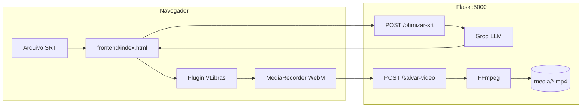

# Conversor SRT para Libras (GrowUp — Grupo 3)

Ferramenta que converte legendas **SRT** em vídeo com avatar **VLibras**: o backend otimiza o texto com IA; o navegador sinaliza no tempo certo, grava o canvas e o servidor gera um **MP4**.

Documentação detalhada da API: **[docs/API.md](docs/API.md)**

---

## Visão geral



Há também uma **API de validação** que checa vocabulário no banco oficial do VLibras (sem gravar vídeo). Ver [docs/API.md](docs/API.md#api-de-validação-vocabulário-vlibras).

---

## Pré-requisitos

- **Python 3.10+**
- **FFmpeg** no PATH (ou `FFMPEG_PATH` no `.env`)
- **Chave Groq** ([console.groq.com](https://console.groq.com))
- **Chrome ou Edge** (recomendado para `canvas.captureStream`)
- Conexão com internet (script do VLibras em `vlibras.gov.br`)

---

## Instalação

```bash
git clone <url-do-repositorio>
cd RESIDENCIA-GLOBO-GRUPO3-GROWUP2026.1
pip install -r requirements.txt
```

Copie o ambiente:

```bash
cp .env.example .env
```

Edite `.env` e defina `GROQ_API_KEY`.

---

## Executar

**Backend:**

```bash
python run.py
```

Servidor em `http://localhost:5000` (CORS liberado para o frontend).

**Interface principal:**

Abra no navegador o arquivo [`frontend/index.html`](frontend/index.html) (duplo clique ou extensão tipo Live Server). O JS usa `API_URL = http://localhost:5000`.

> Abrir só o HTML via `file://` pode causar problemas de CORS ou do plugin VLibras. Prefira servir a pasta `frontend/` por HTTP na mesma máquina.

**Interface alternativa (React):**

```bash
cd srt-libras
npm install
npm run dev
```

App em `http://localhost:3000` (porta pode variar). Mesma API em `:5000`.

---

## Uso do frontend (`frontend/index.html`)

### Fluxo automático (padrão)

1. Selecione um arquivo `.srt` → o sistema chama **`POST /otimizar-srt`** e mostra a prévia (original vs texto otimizado).
2. Clique em **Abrir / Fechar VLibras** → abre o avatar e **inicia a gravação** automaticamente (se o SRT já foi processado).
3. Ao terminar as legendas, o WebM é enviado para **`POST /salvar-video`** e aparece o link **Baixar MP4**.

### Fluxo manual

- **Processar SRT** — otimiza sem depender do `change` do input.
- **Gerar Vídeo** — grava após o VLibras estar aberto e o plugin pronto.

### Boas práticas

- Mantenha a aba **visível e ativa** durante a gravação.
- Aguarde o boneco do VLibras carregar antes de gravar (o fluxo automático espera ~1,5 s após abrir).
- Arquivo de teste na raiz: `teste-avatar.srt` (5 falas, ~22 s).

---

## Estrutura do projeto

```
├── run.py                 # Entrada: Flask na porta 5000
├── requirements.txt
├── .env.example
├── frontend/
│   └── index.html         # UI principal (SRT + VLibras + gravação)
├── srt-libras/            # Mesma ideia em React + Vite (opcional)
├── app/
│   ├── __init__.py        # create_app(), blueprints, CORS
│   ├── config.py          # MEDIA_DIR, GROQ, FFMPEG
│   ├── routes/
│   │   ├── srt_routes.py      # otimizar, vídeo, download
│   │   └── validacao_routes.py # validar frase/SRT, vocabulário
│   ├── services/
│   │   ├── groq_service.py    # Otimização SRT (IA)
│   │   ├── ffmpeg_service.py  # WebM → MP4
│   │   ├── srt_service.py       # Gera SRT otimizado
│   │   ├── vlibras_db.py      # Banco de sinais
│   │   ├── sinonimo_service.py
│   │   └── validacao_service.py
│   └── utils/
│       ├── parser.py          # Parse SRT
│       └── timestamp.py
├── vlibrasDataBase/       # JSONs de termos VLibras
├── media/                 # Vídeos gerados (MP4; WebM temporário)
├── tests/
│   └── test_validacao.py
└── docs/
    └── API.md             # Referência completa da API
```

---

## API (resumo)

| Método | Rota | Função |
|--------|------|--------|
| `GET` | `/` | Health check |
| `POST` | `/otimizar-srt` | SRT → legendas otimizadas (Groq) |
| `POST` | `/salvar-video` | WebM → MP4 em `media/` |
| `GET` | `/download-video/<nome>` | Download do MP4 |
| `GET` | `/videos` | Lista MP4s gerados |
| `POST` | `/validar-frase` | Valida texto (banco + sinônimos) |
| `POST` | `/validar-srt` | Valida SRT inteiro |
| `GET` | `/vocab/info` | Tamanho do vocabulário |
| `GET` | `/vocab/buscar?q=` | Busca um termo |

Exemplos de request/response, códigos de erro e modelos JSON: **[docs/API.md](docs/API.md)**

---

## Configuração

| Variável | Descrição |
|----------|-----------|
| `GROQ_API_KEY` | Obrigatória para `/otimizar-srt` e sinônimos na validação |
| `FFMPEG_PATH` | Opcional; padrão `ffmpeg` |

Vídeos finais: pasta **`media/`**, nome `libras_YYYYMMDD_HHMMSS.mp4`.

---

## Tecnologias

- **Backend:** Flask, flask-cors, requests, python-dotenv
- **IA:** Groq API (`llama-3.3-70b-versatile`)
- **Vídeo:** FFmpeg (libx264, 1920×1080)
- **Frontend:** HTML/JS + [VLibras Widget](https://www.vlibras.gov.br/)
- **Validação:** JSONs `signspatch201830/31.json`

---

## Limitações conhecidas

- A otimização por IA **não garante** que todo termo exista no VLibras (a API `/validar-*` existe para isso, mas não está ligada ao `index.html`).
- A gravação depende do canvas do plugin; falhas de rede no `vlibras.gov.br` impedem o avatar.
- Apenas legendas em **UTF-8** são suportadas no upload.

---

## Licença e créditos

Projeto acadêmico — Residência Globo / GrowUp 2026.  
VLibras: Governo Federal ([vlibras.gov.br](https://www.vlibras.gov.br)).
